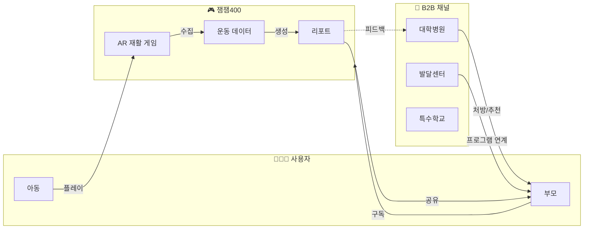
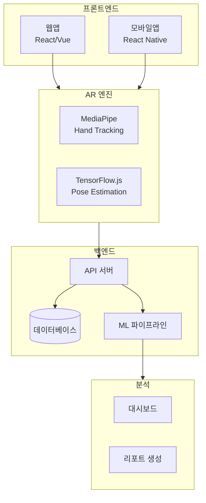
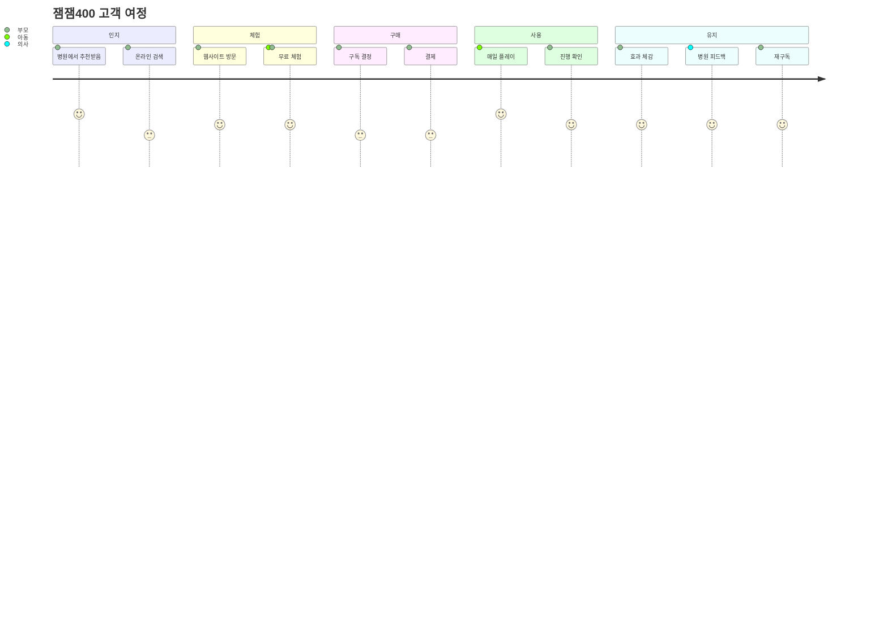
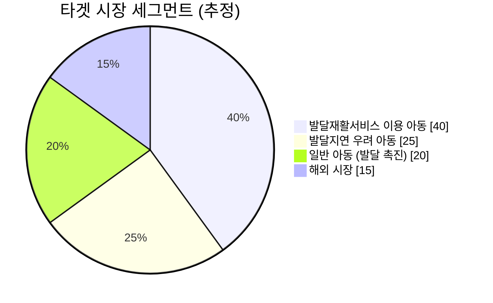
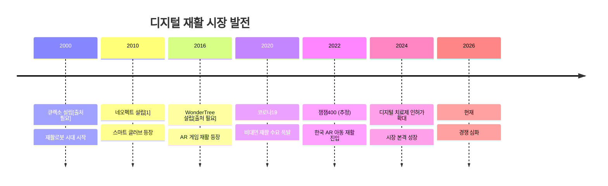
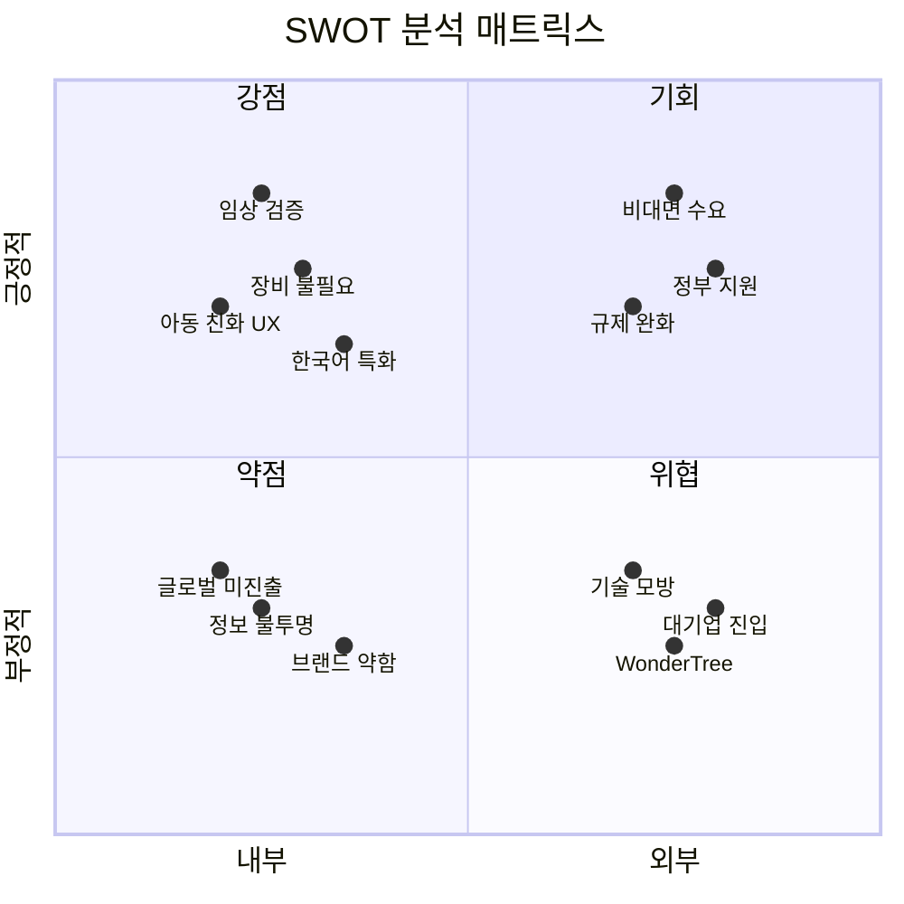
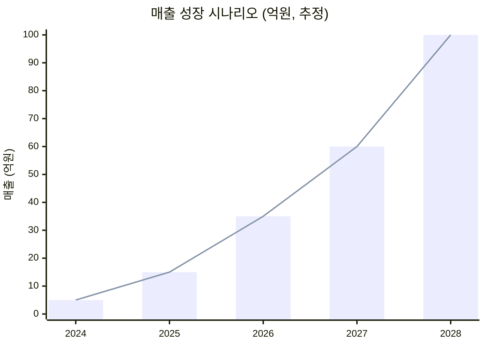
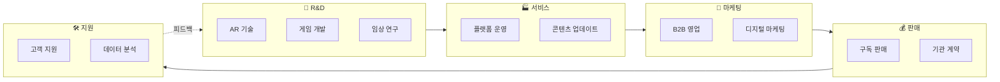
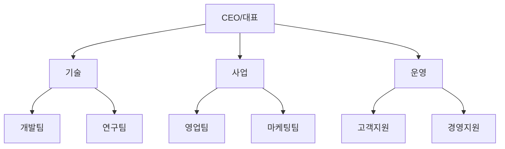

# Mermaid 차트 모음

> 이 문서의 차트들은 Mermaid 문법으로 작성되었습니다.
> GitHub, Notion, Obsidian 등에서 렌더링됩니다.

---

## 1. 비즈니스 모델 흐름도



---

## 2. 기술 스택 (추정)



---

## 3. 고객 여정 맵



---

## 4. 시장 세그먼트



---

## 5. 경쟁 구도 타임라인



> ⚠️ WonderTree 설립 연도(2016년)와 큐렉소 설립 연도(2000년)는 공식 출처 확인 필요

---

## 6. SWOT 다이어그램



---

## 7. 매출 성장 시나리오 (가상)



---

## 8. 가치 사슬



---

## 9. 조직 구조 (추정)



---

## 사용법

### GitHub에서 보기
GitHub에서는 `.md` 파일 내 Mermaid 코드가 자동 렌더링됩니다.

### 로컬에서 보기
1. VS Code + Mermaid Preview 확장
2. Obsidian
3. Typora

### 이미지로 내보내기
```bash
# mermaid-cli 설치
npm install -g @mermaid-js/mermaid-cli

# PNG로 변환
mmdc -i diagrams.md -o output.png
```

---

> 📅 마지막 업데이트: 2026-02-07

---

## 출처

[1] THE VC, "네오펙트(라파엘 스마트 글러브) 기업정보", 2026년 2월 확인, https://thevc.kr/neofect - 2010년 6월 설립 확인

> ⚠️ 본 문서의 매출 성장 시나리오, 시장 세그먼트 비율 등은 추정/가상 데이터입니다.
