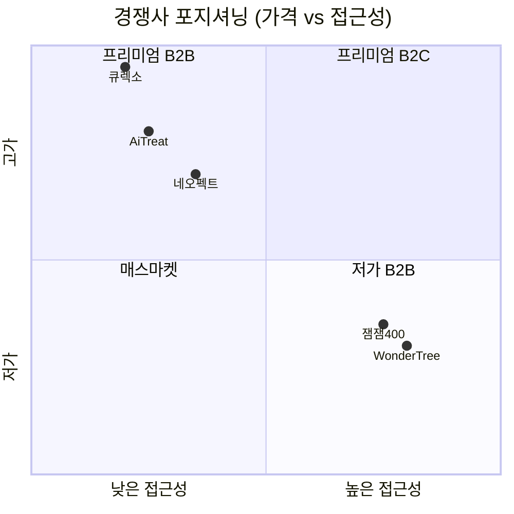

# 경쟁사 분석

## 경쟁 구도 개요

## 경쟁사 비교표

| 구분 | 잼잼400 | WonderTree | 네오펙트 | 큐렉소 |
|------|---------|------------|----------|--------|
| **국가** | 🇰🇷 한국 | 🇵🇰 파키스탄 | 🇰🇷 한국 | 🇰🇷 한국 |
| **설립** | 미확인 | 2016 | 2010 | 2000 |
| **기술** | AR 게임 | AR 게임 | 스마트 글러브 | 재활 로봇 |
| **타겟** | 아동 소근육 | 아동 특수교육 | 뇌졸중/재활 | 보행 재활 |
| **장비** | 불필요 | 불필요 | 필요 (글러브) | 필요 (로봇) |
| **가격대** | 미확인 | 구독형 | 고가 | 매우 고가 |
| **B2B** | 병원/발달센터 | 학교/센터 | 병원/재활원 | 병원 |
| **B2C** | ✅ | ✅ | ⚠️ 제한적 | ❌ |
| **투자** | 미확인 | 시드 투자 | 시리즈 B+ | 코스닥 상장 |
| **글로벌** | ❌ | ✅ 16개국+ | ✅ | ✅ |

## 상세 경쟁사 프로필

---

### 1. WonderTree 🎯 (직접 경쟁사)

> **"Play Fun & Inclusive Online Games for Children with Special Needs"**

| 항목 | 내용 |
|------|------|
| **웹사이트** | https://wondertree.co |
| **본사** | 파키스탄 (글로벌 진출) |
| **타겟** | ADHD, ASD, DCD, 다운증후군, 뇌성마비 아동 |
| **기술** | AR 기반 웹 게임 |
| **장비** | 웹캠만 필요 |

**주요 게임 라인업:**
- Express Monsters (감정 인식)
- Scoop'd (운동 조절)
- Bubble Pop (주의력/반응)
- ABC Trace (인지/교육)
- Balance It (균형/자세)

**타겟 스킬:**
- Cognitive Skills (인지)
- Motor Skills (운동)
- Educational Skills (교육)

**차별점 vs 잼잼400:**
| 항목 | WonderTree | 잼잼400 |
|------|------------|---------|
| 게임 수 | 10개+ | 미확인 |
| 글로벌 진출 | ✅ | ❌ |
| 다국어 지원 | ✅ | 한/영 |
| 임상 검증 | 언급 있음 | 대학병원 강조 |
| 가격 | Free trial 있음 | 미확인 |

---

### 2. 네오펙트 (Neofect) 📍 (간접 경쟁사)

> **"Redefining Possibilities with Convergence Technology"**

| 항목 | 내용 |
|------|------|
| **웹사이트** | https://neofect.com |
| **본사** | 한국 |
| **설립** | 2010년 |
| **타겟** | 뇌졸중 환자, 상지 재활 |
| **주력 제품** | RAPAEL Smart Glove |
| **투자** | 시리즈 B (약 200억원+) |

**핵심 제품: RAPAEL Smart Glove**
- 손가락 움직임 센싱 글러브
- 게임화된 재활 프로그램
- 임상 연구: WMFT 점수 3배 개선 (vs 기존 물리치료)

**차별점 vs 잼잼400:**
| 항목 | 네오펙트 | 잼잼400 |
|------|----------|---------|
| 하드웨어 | 필요 (고가) | 불필요 |
| 타겟 연령 | 성인 (뇌졸중) | 아동 |
| B2B 중심 | ✅ | ✅ (B2C 확장 중) |
| 임상 데이터 | 풍부 | 있음 (상세 미확인) |

---

### 3. 큐렉소 (Curexo) 📍 (간접 경쟁사)

> **"의료로봇 전문기업 (수술로봇·재활로봇)"**

| 항목 | 내용 |
|------|------|
| **웹사이트** | https://curexo.com |
| **본사** | 한국 |
| **설립** | 2000년 |
| **상장** | 코스닥 (2021) |
| **시가총액** | ~1,000억원 |

**주력 제품: 모닝워크 (MORNING WALK)**
- 보행재활로봇 시스템
- End-effector 방식
- BCI, VR 연동 연구 진행 중
- 서울대, 샤리테 의대, 텍사스 의대 협력

**차별점 vs 잼잼400:**
| 항목 | 큐렉소 | 잼잼400 |
|------|--------|---------|
| 제품 형태 | 대형 로봇 | 소프트웨어 |
| 가격 | 수억원대 | 저가 (추정) |
| 타겟 | 하지 재활 | 상지 소근육 |
| 설치 환경 | 병원 전용 | 어디서나 |

---

### 4. AiTreat 📍 (간접 경쟁사/해외)

> **"World's First Precise Soft Tissue Therapeutic Treatment Robot"**

| 항목 | 내용 |
|------|------|
| **웹사이트** | https://aitreat.com |
| **본사** | 싱가폴 |
| **주력 제품** | EMMA 치료 로봇 |
| **투자** | 시리즈 A+ (멀티밀리언) |
| **진출국** | 싱가폴, 중국, 미국 |

---

## 포지셔닝 맵

## 경쟁 우위 분석

### 잼잼400의 차별화 포인트

### 경쟁 대응 전략 제안

| 경쟁사 | 위협 수준 | 대응 전략 |
|--------|----------|----------|
| **WonderTree** | 🔴 높음 | 한국 시장 선점, 임상 데이터 강화, 국내 병원 파트너십 확대 |
| **네오펙트** | 🟡 중간 | 타겟 차별화 (아동 vs 성인), 보완재 포지셔닝 |
| **큐렉소** | 🟢 낮음 | 직접 경쟁 회피, 다른 가격대/타겟 |
| **빅테크** | 🟡 중간 | 틈새시장 집중, 전문성 강조, 빠른 성장 |

---

## 벤치마킹 인사이트

### WonderTree에서 배울 점

1. **게임 다양성**: 10개+ 게임 라인업으로 다양한 스킬 커버
2. **글로벌 진출**: 초기부터 영어 기반으로 글로벌 시장 공략
3. **명확한 타겟팅**: ADHD, ASD 등 구체적 장애 유형 명시
4. **무료 체험**: Free trial로 진입 장벽 낮춤

### 네오펙트에서 배울 점

1. **임상 데이터**: 정량적 효과 검증 (WMFT 3배 개선)
2. **학술 논문**: 연구 결과 학술지 게재
3. **IR 스토리**: 투자자 대상 명확한 메시지

---

> 📌 **결론**: 잼잼400은 "장비 불필요 + 아동 특화 + 한국 시장"이라는 포지션에서 WonderTree와 직접 경쟁. 글로벌 확장 전 국내 시장 선점 및 임상 데이터 축적이 핵심 전략.
