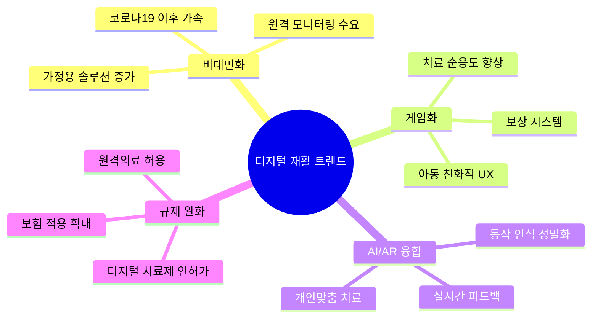

# 시장 분석: 디지털 재활/치료 게임 시장

## 시장 개요

### 타겟 시장 정의

잼잼400이 속한 시장:
- **1차 시장**: 아동용 디지털 재활 솔루션
- **2차 시장**: AR/VR 기반 헬스케어
- **3차 시장**: 에듀테크 (특수교육)

### 시장 규모 (글로벌)

| 시장 | 2024 규모 | 2030 전망 | CAGR |
|------|----------|----------|------|
| 디지털 치료제 (DTx) | $6.1B | $17.5B | 19.2% |
| 재활 로봇/기기 | $1.8B | $5.8B | 21.5% |
| 아동 발달 앱 | $3.2B | $8.7B | 18.1% |
| AR/VR 헬스케어 | $4.5B | $25.2B | 33.2% |

> *출처: Grand View Research, Markets and Markets (2024)*

### 한국 시장

| 항목 | 규모 | 비고 |
|------|------|------|
| 발달장애 아동 | 약 9만 명 | 등록 장애인 기준 |
| 발달재활서비스 이용자 | 약 7만 명/년 | 바우처 이용 기준 |
| 발달재활서비스 예산 | 약 2,500억원/년 | 정부 지원 |

## 시장 동향

### 주요 트렌드



### 시장 성장 드라이버

1. **인구통계적 요인**
   - 발달장애 진단 증가 (조기 진단 확대)
   - 맞벌이 가정 증가 → 가정용 솔루션 수요

2. **기술적 요인**
   - AR/VR 기기 보급 확대
   - 모바일 디바이스 성능 향상
   - AI 동작 인식 기술 발전

3. **정책적 요인**
   - 발달재활서비스 바우처 확대
   - 디지털 치료제 인허가 가이드라인 정립
   - 비대면 의료 규제 완화

4. **사회적 요인**
   - 재활치료사 인력 부족
   - 치료 비용 부담 → 저비용 대안 수요
   - 코로나19 이후 비대면 수용도 증가

## 고객 세그먼트

### B2B 고객

| 세그먼트 | 니즈 | 결정 요인 |
|----------|------|----------|
| 대학병원 | 임상 연구, 최신 기술 도입 | 학술적 검증, 연구 파트너십 |
| 재활의학과 | 치료 효율화, 환자 관리 | 임상 효과, 보험 적용 |
| 발달센터 | 치료 프로그램 다양화 | 가격, 아동 선호도 |
| 특수학교 | 교육 도구 | 교육과정 연계, 예산 |

### B2C 고객

| 세그먼트 | 니즈 | 결정 요인 |
|----------|------|----------|
| 재활치료 중인 아동 부모 | 가정 내 치료 연속성 | 병원 연계, 전문성 |
| 발달 지연 우려 부모 | 조기 개입 | 사용 편의성, 효과 검증 |
| 일반 부모 | 아동 발달 지원 | 재미, 가격 |

## 진입 장벽

### 높은 장벽
- 🔴 임상 검증 필요 (시간/비용 소요)
- 🔴 의료기기 인허가 (규제 복잡성)
- 🔴 B2B 영업 (병원/기관 의사결정 긴 사이클)

### 낮은 장벽
- 🟢 기술 진입장벽 (AR/게임 기술 접근성 높음)
- 🟢 초기 자본 (하드웨어 불필요 시)
- 🟢 B2C 고객 획득 (앱스토어 배포)

## SWOT 분석: 잼잼400

```mermaid
quadrantChart
    title SWOT 분석
    x-axis 내부 요인 --> 외부 요인
    y-axis 부정적 --> 긍정적
    quadrant-1 기회 (O)
    quadrant-2 강점 (S)
    quadrant-3 약점 (W)
    quadrant-4 위협 (T)
    "임상 검증": [0.3, 0.8]
    "장비 불필요": [0.2, 0.7]
    "아동 친화 UX": [0.35, 0.65]
    "법인정보 불투명": [0.25, 0.3]
    "브랜드 인지도 낮음": [0.4, 0.25]
    "비대면 수요 증가": [0.7, 0.85]
    "정부 지원 확대": [0.8, 0.75]
    "글로벌 경쟁사": [0.75, 0.2]
    "대형사 진입 가능": [0.65, 0.35]
```

### 상세 SWOT

| | 긍정적 | 부정적 |
|---|---|---|
| **내부** | **강점 (S)** | **약점 (W)** |
| | • 대학병원 임상 검증 | • 법인/재무 정보 불투명 |
| | • 장비 없이 사용 가능 | • 브랜드 인지도 낮음 |
| | • 아동 친화적 게임 UX | • 투자 유치 이력 불명확 |
| | • 가정-병원 연계 가능 | • 마케팅/영업 역량 미지수 |
| **외부** | **기회 (O)** | **위협 (T)** |
| | • 비대면 재활 수요 증가 | • WonderTree 등 글로벌 경쟁사 |
| | • 발달재활 바우처 확대 | • 네오펙트 등 국내 대형사 |
| | • 디지털 치료제 규제 완화 | • 빅테크 헬스케어 진입 |
| | • 아동 발달 관심 증가 | • 기술 모방 용이 |

---

> 📌 **시사점**: 잼잼400은 "임상 검증 + 장비 불필요"라는 차별점으로 틈새시장 공략 가능. 단, 스케일업을 위해서는 투자 유치 및 브랜드 구축이 필요.
