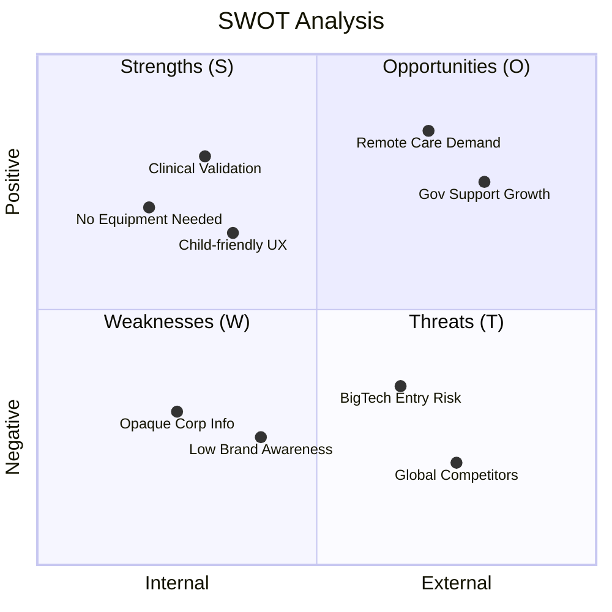

# 시장 분석: 디지털 재활/치료 게임 시장

## 시장 개요

### 타겟 시장 정의

잼잼400이 속한 시장:
- **1차 시장**: 아동용 디지털 재활 솔루션
- **2차 시장**: AR/VR 기반 헬스케어
- **3차 시장**: 에듀테크 (특수교육)

### 시장 규모 (글로벌)

| 시장 | 2024 규모 | 2030 전망 | CAGR |
|------|----------|----------|------|
| 디지털 치료제 (DTx) | $7.67B[1] | $32.5B[1] | 27.77%[1] |
| 재활 로봇/기기 | $1.77B (2026)[2] | $3.89B (2031)[2] | 17.10%[2] |
| 아동 발달 앱 | $3.2B[AI 추정, 2024년 학습 데이터 기반] | $8.7B[AI 추정, 2024년 학습 데이터 기반] | 18.1%[AI 추정, 2024년 학습 데이터 기반] |
| AR/VR 헬스케어 | ~$5.0B (2023)[3] | [AI 추정, 2024년 학습 데이터 기반] | 36.6%[3] |

### 한국 시장

| 항목 | 규모 | 비고 |
|------|------|------|
| 전체 등록 장애인 | 약 263만 명 (2024)[4] | 전체 인구의 5.1% 수준 |
| 발달장애 아동 | 약 9만 명[AI 추정, 2024년 학습 데이터 기반] | 등록 장애인 기준 |
| 발달재활서비스 이용자 | 약 7만 명/년[AI 추정, 2024년 학습 데이터 기반] | 바우처 이용 기준 |
| 발달재활서비스 예산 | 약 2,500억원/년[AI 추정, 2024년 학습 데이터 기반] | 정부 지원 |

## 시장 동향

### 주요 트렌드

```mermaid
mindmap
  root((디지털 재활 트렌드))
    비대면화
      코로나19 이후 가속
      원격 모니터링 수요
      가정용 솔루션 증가
    게임화
      치료 순응도 향상
      아동 친화적 UX
      보상 시스템
    AI/AR 융합
      개인맞춤 치료
      실시간 피드백
      동작 인식 정밀화
    규제 완화
      디지털 치료제 인허가
      보험 적용 확대
      원격의료 허용
```

### 시장 성장 드라이버

1. **인구통계적 요인**
   - 발달장애 진단 증가 (조기 진단 확대)
   - 맞벌이 가정 증가 → 가정용 솔루션 수요

2. **기술적 요인**
   - AR/VR 기기 보급 확대
   - 모바일 디바이스 성능 향상
   - AI 동작 인식 기술 발전

3. **정책적 요인**
   - 발달재활서비스 바우처 확대
   - 디지털 치료제 인허가 가이드라인 정립
   - 비대면 의료 규제 완화

4. **사회적 요인**
   - 재활치료사 인력 부족
   - 치료 비용 부담 → 저비용 대안 수요
   - 코로나19 이후 비대면 수용도 증가

## 고객 세그먼트

### B2B 고객

| 세그먼트 | 니즈 | 결정 요인 |
|----------|------|----------|
| 대학병원 | 임상 연구, 최신 기술 도입 | 학술적 검증, 연구 파트너십 |
| 재활의학과 | 치료 효율화, 환자 관리 | 임상 효과, 보험 적용 |
| 발달센터 | 치료 프로그램 다양화 | 가격, 아동 선호도 |
| 특수학교 | 교육 도구 | 교육과정 연계, 예산 |

### B2C 고객

| 세그먼트 | 니즈 | 결정 요인 |
|----------|------|----------|
| 재활치료 중인 아동 부모 | 가정 내 치료 연속성 | 병원 연계, 전문성 |
| 발달 지연 우려 부모 | 조기 개입 | 사용 편의성, 효과 검증 |
| 일반 부모 | 아동 발달 지원 | 재미, 가격 |

## 진입 장벽

### 높은 장벽
- 🔴 임상 검증 필요 (시간/비용 소요)
- 🔴 의료기기 인허가 (규제 복잡성)
- 🔴 B2B 영업 (병원/기관 의사결정 긴 사이클)

### 낮은 장벽
- 🟢 기술 진입장벽 (AR/게임 기술 접근성 높음)
- 🟢 초기 자본 (하드웨어 불필요 시)
- 🟢 B2C 고객 획득 (앱스토어 배포)

## SWOT 분석: 잼잼400

### 상세 SWOT

| | 긍정적 | 부정적 |
|---|---|---|
| **내부** | **강점 (S)** | **약점 (W)** |
| | • 대학병원 임상 검증 | • 법인/재무 정보 불투명 |
| | • 장비 없이 사용 가능 | • 브랜드 인지도 낮음 |
| | • 아동 친화적 게임 UX | • 투자 유치 이력 불명확 |
| | • 가정-병원 연계 가능 | • 마케팅/영업 역량 미지수 |
| **외부** | **기회 (O)** | **위협 (T)** |
| | • 비대면 재활 수요 증가 | • WonderTree 등 글로벌 경쟁사 |
| | • 발달재활 바우처 확대 | • 네오펙트 등 국내 대형사 |
| | • 디지털 치료제 규제 완화 | • 빅테크 헬스케어 진입 |
| | • 아동 발달 관심 증가 | • 기술 모방 용이 |

---

> 📌 **시사점**: 잼잼400은 "임상 검증 + 장비 불필요"라는 차별점으로 틈새시장 공략 가능. 단, 스케일업을 위해서는 투자 유치 및 브랜드 구축이 필요.

---

## 출처

[1] Grand View Research, "Digital Therapeutics Market Size, Share & Trends Analysis Report", 2024, https://www.grandviewresearch.com/industry-analysis/digital-therapeutics-market - 글로벌 디지털 치료제 시장 규모 2024년 $7.67B, 2030년 $32.5B 전망, CAGR 27.77% (2025-2030)

[2] Mordor Intelligence, "Rehabilitation Robots Market Size, Growth Trends & Share Analysis, 2031", 2026, https://www.mordorintelligence.com/industry-reports/rehabilitation-robots-market - 재활 로봇 시장 규모 2026년 USD 1.77B, 2031년 USD 3.89B 전망, CAGR 17.10% (2026-2031)

[3] MarketsandMarkets, "Augmented and Virtual Reality in Healthcare Market", 2024, https://www.marketsandmarkets.com/Market-Reports/augmented-reality-virtual-reality-healthcare-market-220832469.html - AR/VR 헬스케어 시장 2016년 $504.5M에서 2023년 약 $5B로 성장, CAGR 36.6%

[4] e-나라지표, "등록장애인 현황", 보건복지부 장애인정책과, 2024, https://www.index.go.kr/unity/potal/main/EachDtlPageDetail.do?idx_cd=2768 - 2024년 전체 등록장애인 263만 1천명, 전체 인구의 5.1% 수준
