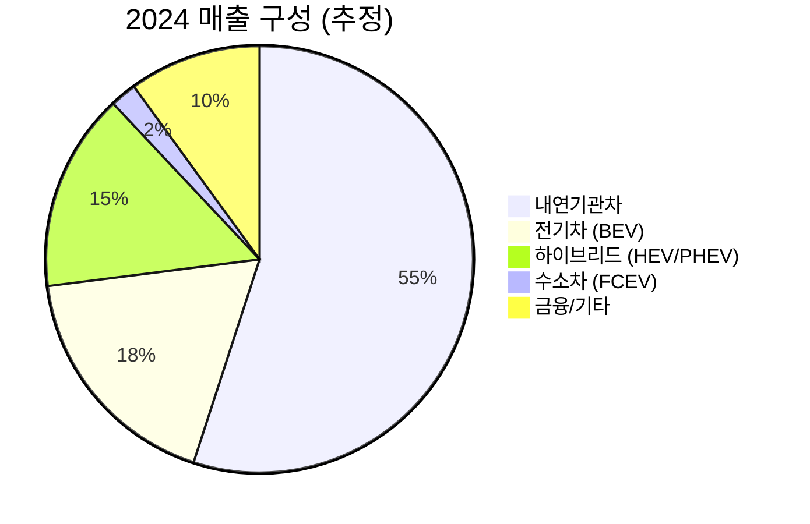

# 현대자동차 (Hyundai Motor Company) 기업 분석 보고서

> 📅 작성일: 2026-02-07  
> 🦊 작성자: Bernard (OpenClaw)

## 📁 문서 구조

```
hyundai-motor/
├── README.md                 # 이 파일 (개요)
├── company-profile.md        # 기업 프로필
├── market-analysis.md        # 시장 분석
├── competitors.md            # 경쟁사 분석
└── charts/
    └── diagrams.md           # Mermaid 차트 모음
```

## 🎯 핵심 요약

| 항목 | 내용 |
|------|------|
| **기업명** | 현대자동차주식회사 (Hyundai Motor Company) |
| **종목코드** | 005380 (KRX) |
| **웹사이트** | https://www.hyundai.com |
| **사업 분야** | 완성차 제조 / 전기차 / 모빌리티 솔루션 |
| **글로벌 순위** | 세계 3위 자동차 그룹 (현대차그룹 기준) |
| **핵심 브랜드** | Hyundai, Genesis, IONIQ |
| **2024 판매량** | 약 420만대 (현대차 단독) |

## 💡 투자 포인트

### 강점 (Strengths)
- ✅ **글로벌 3위**: 기아 포함 시 세계 3위 자동차 그룹
- ✅ **전기차 선두**: IONIQ 5/6, E-GMP 플랫폼 경쟁력
- ✅ **수소차 독보적**: NEXO, 수소전기트럭 등 수소 생태계 선도
- ✅ **제네시스 성공**: 프리미엄 브랜드 안착, 북미/유럽 확장
- ✅ **로보틱스/AAM**: 보스턴 다이나믹스, UAM 신사업 포트폴리오

### 리스크 (Risks)
- ⚠️ **환율 변동**: 원화 강세 시 수익성 악화
- ⚠️ **중국 리스크**: 중국 시장 점유율 하락 지속
- ⚠️ **노사 리스크**: 강성 노조, 파업 이력
- ⚠️ **EV 경쟁 심화**: 테슬라, BYD, 레거시 OEM 전환 가속
- ⚠️ **원자재 가격**: 배터리 원자재(리튬, 니켈) 가격 변동

## 📊 재무 하이라이트 (2024E)

| 지표 | 수치 | YoY |
|------|------|-----|
| **매출** | ~165조원 | +8% |
| **영업이익** | ~15.5조원 | +5% |
| **영업이익률** | ~9.4% | - |
| **순이익** | ~12조원 | +3% |
| **시가총액** | ~55조원 | - |
| **PER** | ~5배 | - |
| **PBR** | ~0.5배 | - |

## 🚗 사업 포트폴리오



## 🏆 경쟁 포지션

| 순위 | 그룹 | 2024 판매량 | 비고 |
|------|------|------------|------|
| 1 | 토요타 | ~1,050만대 | |
| 2 | 폭스바겐 | ~900만대 | |
| **3** | **현대차그룹** | **~730만대** | 현대+기아 |
| 4 | 스텔란티스 | ~600만대 | |
| 5 | GM | ~600만대 | |

## 🔋 전기차 전략

- **2030 목표**: 연 200만대 EV 판매
- **플랫폼**: E-GMP (전용), IMA (통합 모듈러)
- **배터리**: LG에너지솔루션, SK온, CATL 다변화
- **충전 인프라**: NACS 채택 (북미), E-pit 네트워크

---

📄 상세 분석은 각 문서 참조
