# Mermaid 차트 모음

## 1. 기업 구조

### 현대차그룹 지배구조

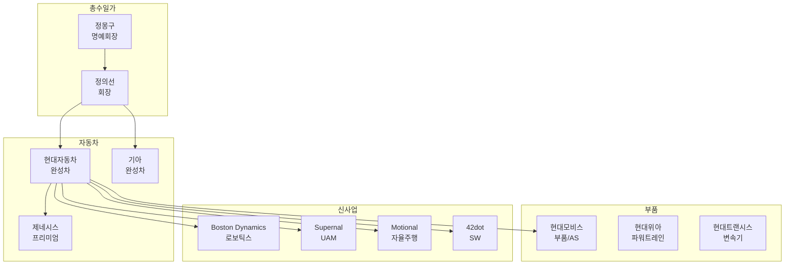

### 브랜드 포트폴리오

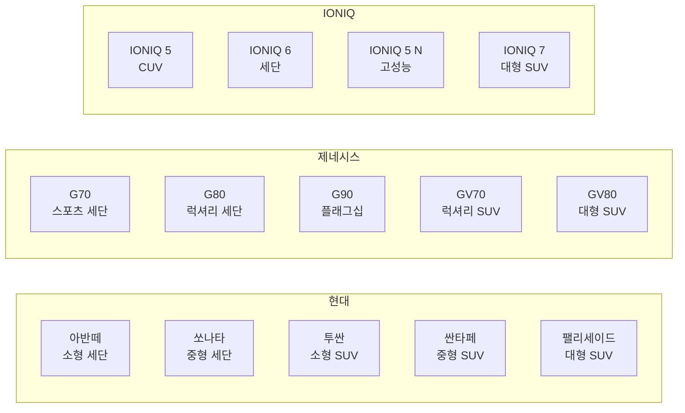

## 2. 시장 분석

### 글로벌 자동차 시장 점유율

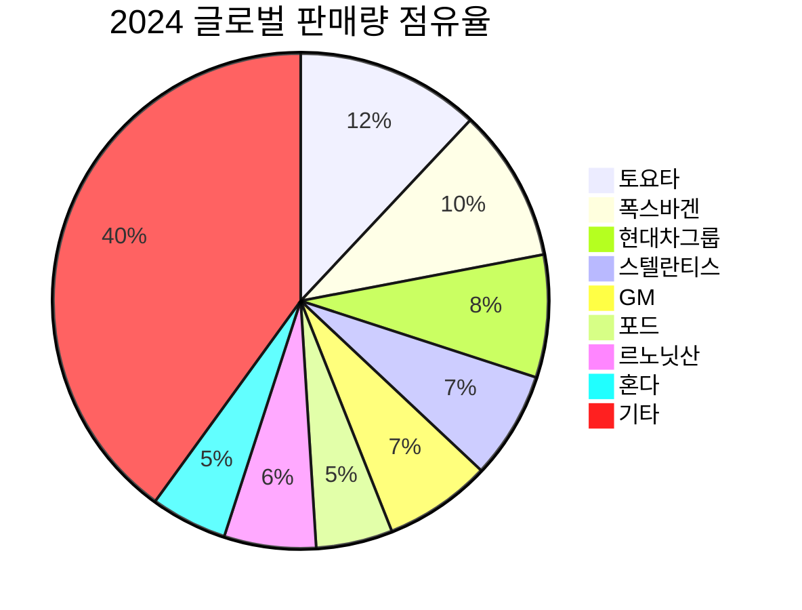

### EV 판매량 추이

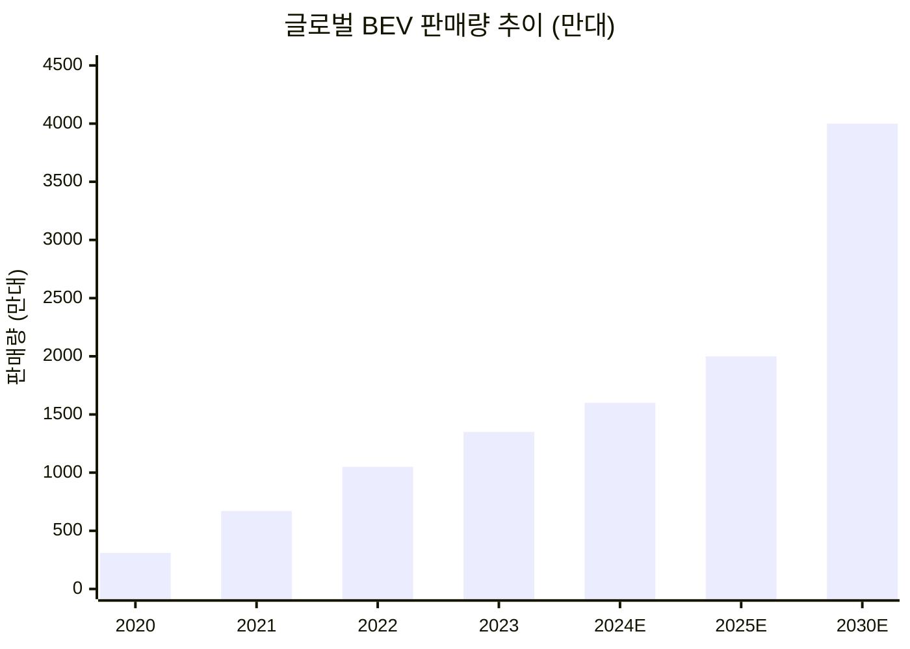

### 지역별 전략

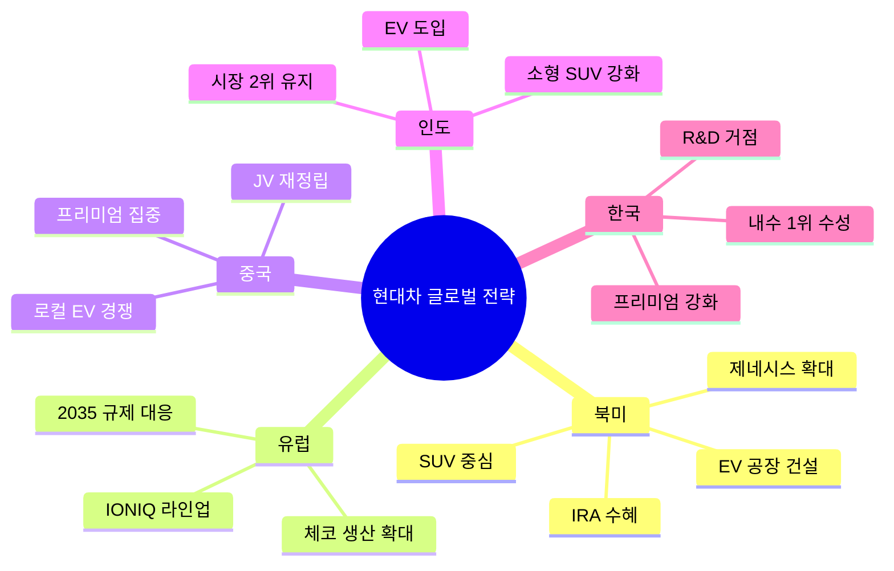

## 3. 재무 분석

### 실적 추이

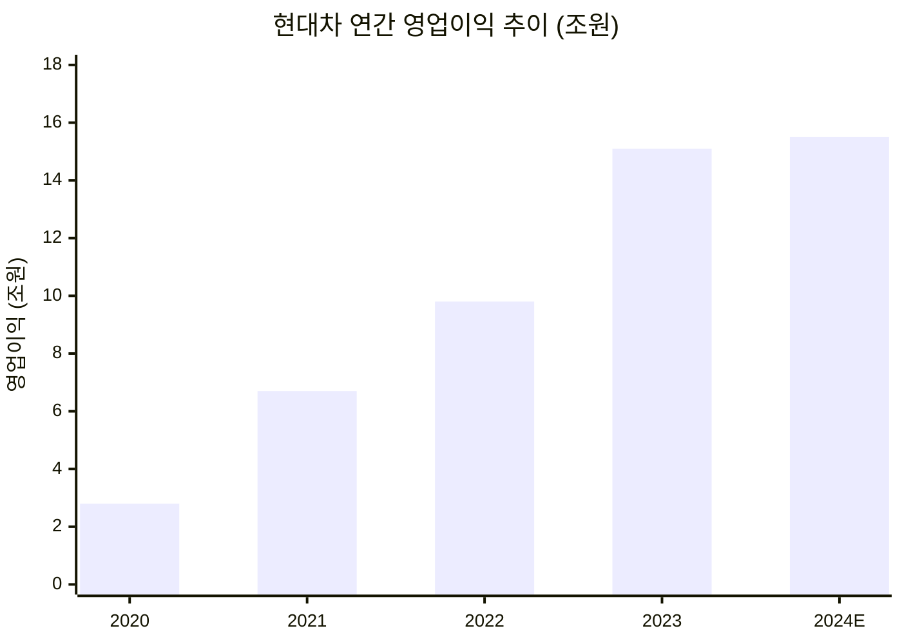

### 매출 구성

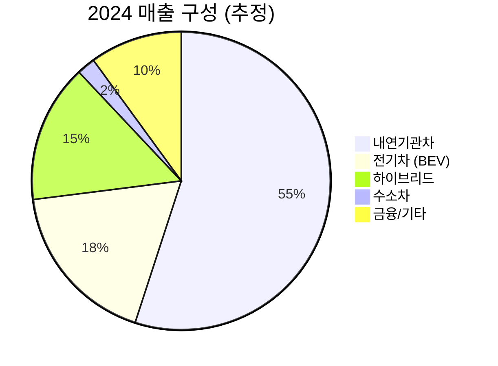

## 4. EV 전략

### E-GMP 플랫폼 구조

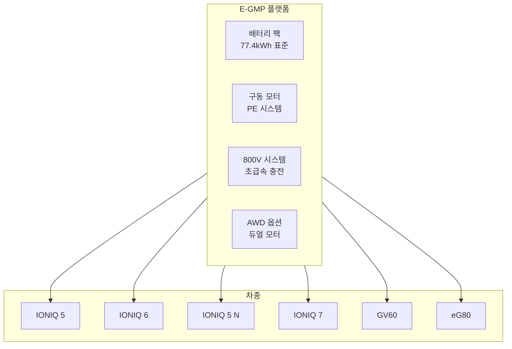

### EV 로드맵

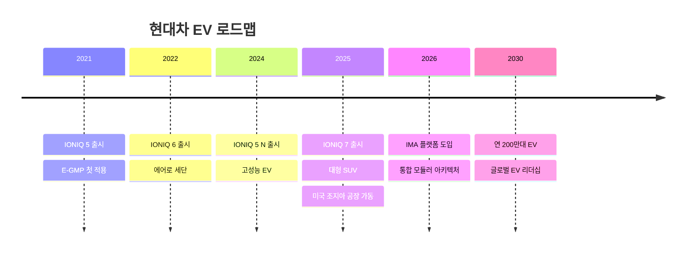

## 5. 경쟁 분석

### 경쟁 포지셔닝

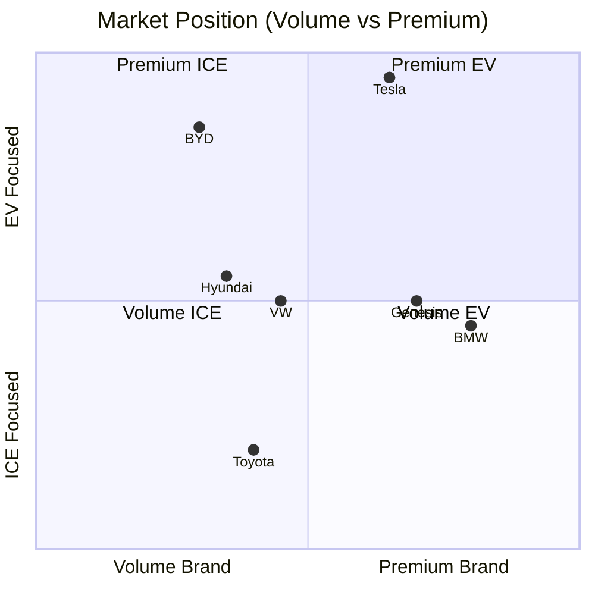

### 밸류체인 비교

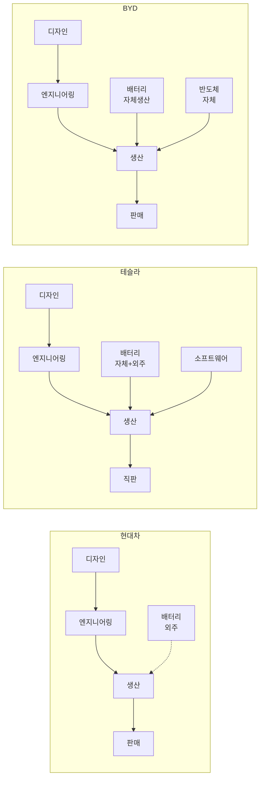

## 6. SWOT 분석

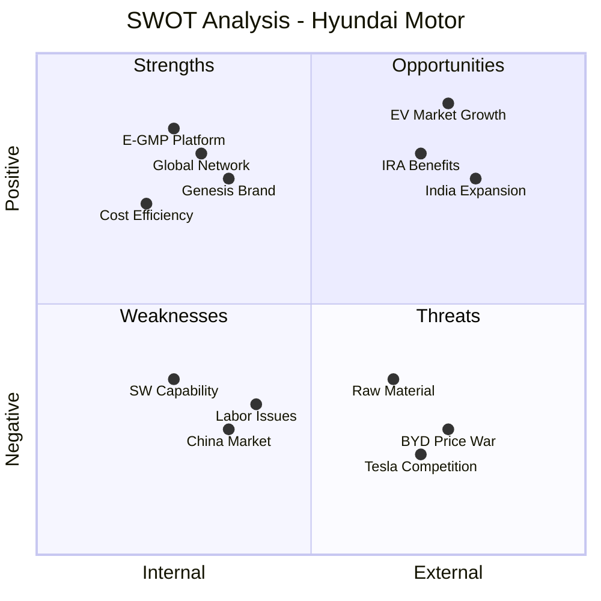

---

> 💡 **참고**: Mermaid 차트는 GitHub에서 네이티브 렌더링됩니다. 일부 복잡한 차트 타입은 렌더링이 제한될 수 있습니다.

## 출처

본 차트의 데이터는 다음 문서들을 참조합니다:
- company-profile.md: 기업 구조, 브랜드 포트폴리오, 재무 실적
- market-analysis.md: 시장 규모, EV 판매량 추이, 지역별 전략
- competitors.md: 경쟁사 비교, 포지셔닝 분석

각 데이터 포인트의 상세 출처는 해당 원본 문서의 "## 출처" 섹션을 참조하시기 바랍니다.
