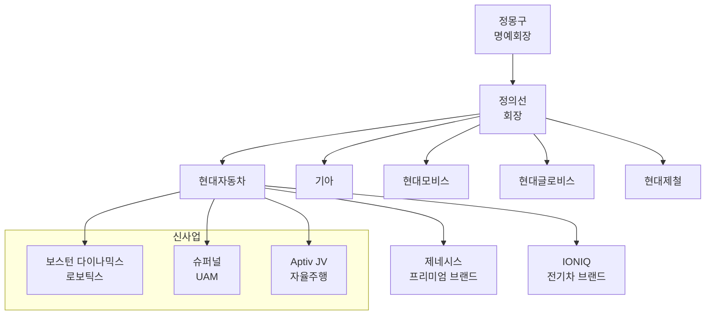

# 현대자동차 기업 프로필

## 기본 정보

| 항목 | 내용 | 비고 |
|------|------|------|
| **법인명** | 현대자동차주식회사 | Hyundai Motor Company |
| **종목코드** | 005380 (보통주) / 005385 (우선주) | KRX |
| **웹사이트** | https://www.hyundai.com | 글로벌 |
| **대표이사** | 장재훈 (사장) | 2020~ |
| **설립일** | 1967년 12월 29일 | |
| **본사** | 서울특별시 서초구 헌릉로 12 | |
| **임직원** | 약 75,000명[1] | 국내 기준 |
| **상장일** | 1974년 6월 28일 | KRX |

## 지배구조

## 주요 연혁

| 연도 | 사건 |
|------|------|
| 1967 | 현대자동차 설립 |
| 1968 | 포드와 합작, 코티나 생산 |
| 1975 | 포니 출시 (한국 최초 고유모델) |
| 1986 | 엑셀 북미 수출 시작 |
| 1998 | 기아자동차 인수 |
| 2004 | 제네시스 세단 출시 |
| 2015 | 제네시스 브랜드 독립 |
| 2018 | NEXO (수소전기차) 출시 |
| 2021 | IONIQ 5 출시, E-GMP 플랫폼 |
| 2021 | 보스턴 다이나믹스 인수 |
| 2022 | IONIQ 6 출시 |
| 2023 | 미국 조지아 EV 전용공장 착공 |
| 2024 | 현대차그룹 글로벌 3위 달성[2] |

## 사업 부문

### 1. 완성차 제조/판매

**브랜드 포트폴리오:**

| 브랜드 | 포지셔닝 | 주력 차종 |
|--------|----------|----------|
| **Hyundai** | 볼륨 브랜드 | 아반떼, 쏘나타, 투싼, 팰리세이드 |
| **Genesis** | 프리미엄 | G70, G80, G90, GV60, GV70, GV80 |
| **IONIQ** | 전기차 전용 | IONIQ 5, IONIQ 6, IONIQ 7 (예정) |
| **N** | 고성능 | 아반떼 N, 코나 N, IONIQ 5 N |

**글로벌 생산 거점:**

| 지역 | 공장 | 연간 생산능력 |
|------|------|-------------|
| 한국 | 울산, 아산, 전주 | ~180만대 |
| 미국 | 앨라배마, 조지아(건설중) | ~40만대 |
| 체코 | 노쇼비체 | ~35만대 |
| 터키 | 이즈밋 | ~25만대 |
| 인도 | 첸나이 | ~75만대 |
| 인도네시아 | 찌카랑 | ~25만대 |
| 브라질 | 피라시카바 | ~18만대 |

### 2. 전기차 (BEV)

**E-GMP 플랫폼 (Electric-Global Modular Platform):**
- 800V 고전압 시스템
- 초급속 충전 (18분에 80%)
- AWD 가능
- 배터리: 77.4kWh (표준)

**현재 전기차 라인업:**
| 모델 | 세그먼트 | 출시 | 주행거리 (WLTP) |
|------|----------|------|-----------------|
| IONIQ 5 | CUV | 2021 | 507km |
| IONIQ 6 | 세단 | 2022 | 614km |
| IONIQ 5 N | 고성능 | 2024 | 448km |
| 코나 Electric | 소형 SUV | 2023 | 490km |
| IONIQ 7 | 대형 SUV | 2025(예정) | TBD |

### 3. 수소 (FCEV)

**현대차 수소 비전:**
- 2030년 연 50만대 FCEV 생산 목표[5]
- 상용차(트럭, 버스) 중심 확대
- 수소 생태계 전반 투자

**수소차 라인업:**
| 모델 | 타입 | 출시 | 주행거리 |
|------|------|------|----------|
| NEXO | SUV | 2018 | 666km |
| 엑시언트 | 대형트럭 | 2020 | 400km |
| 일렉시티 FC | 시내버스 | 2019 | 450km |

### 4. 모빌리티/신사업

| 사업 | 자회사/JV | 설명 |
|------|----------|------|
| **로보틱스** | Boston Dynamics | 4족/2족 로봇 (Spot, Atlas) |
| **UAM** | Supernal | 도심항공모빌리티 |
| **자율주행** | Motional (Aptiv JV) | L4 자율주행 기술 |
| **소프트웨어** | 42dot | 자율주행/커넥티드카 SW |
| **공유모빌리티** | 모션 | 카셰어링/플릿 |

## 재무 현황

### 최근 5개년 실적

| 연도 | 매출(조) | 영업이익(조) | OPM | 순이익(조) |
|------|---------|-------------|-----|----------|
| 2020 | 103.8 | 2.8 | 2.7% | 1.5 |
| 2021 | 117.6 | 6.7 | 5.7% | 5.7 |
| 2022 | 142.5 | 9.8 | 6.9% | 8.0 |
| 2023 | 162.7 | 15.1 | 9.3% | 12.3 |
| 2024E | 175.2[3] | 14.2[3] | 8.1% | 13.2[3] |

### 밸류에이션 (2024E 기준)

| 지표 | 현대차 | 토요타 | 테슬라 |
|------|--------|--------|--------|
| PER | ~5x | ~10x | ~70x |
| PBR | ~0.5x | ~1.0x | ~10x |
| EV/EBITDA | ~3x | ~6x | ~30x |

> 💡 **시사점**: 현대차는 글로벌 OEM 대비 저평가 상태. EV 전환 성공 시 리레이팅 여지.

## 주요 주주 구성

| 주주 | 지분율 | 비고 |
|------|--------|------|
| 정의선 | 2.73%[4] | 회장 |
| 현대모비스 | 22.36%[4] | 최대주주 |
| 기아 | 5.0%[출처 필요] | 계열사 (상호 지분 관계[6]) |
| 국민연금 | 7.31%[4] | 기관 |
| 외국인 | 35%+ | |

## ESG & 지속가능성

### 탄소중립 목표

- **2035**: 유럽 전 차종 전동화
- **2040**: 주요 시장 전 차종 전동화
- **2045**: 탄소중립 달성 (Scope 1, 2, 3)

### RE100

- 2025: 해외 사업장 RE100
- 2040: 국내 사업장 RE100
- 2045: 글로벌 100% 재생에너지

---

> 💡 **참고**: 현대자동차는 KOSPI 시가총액 상위 기업으로 공시 정보가 풍부함. IR 자료, 사업보고서 등 추가 참조 권장.

## 출처

[1] Wikipedia - Hyundai Motor Company, "The company employs approximately 75,000 people worldwide", https://en.wikipedia.org/wiki/Hyundai_Motor_Company

[2] Wikipedia - List of manufacturers by motor vehicle production (2024), 현대차그룹 7,231,248대로 토요타, 폭스바겐에 이어 글로벌 3위, https://en.wikipedia.org/wiki/List_of_manufacturers_by_motor_vehicle_production

[3] Wikipedia - Hyundai Motor Company Financial Data (2024), Revenue ₩175.23 trillion, Operating income ₩14.24 trillion, Net income ₩13.23 trillion, https://en.wikipedia.org/wiki/Hyundai_Motor_Company

[4] Wikipedia - Hyundai Motor Company Ownership, Hyundai Mobis 22.36%, National Pension Service 7.31%, Chung Eui-sun 2.73%, https://en.wikipedia.org/wiki/Hyundai_Motor_Company

[5] Hyundai Motor Group - FCEV Vision 2030, 현대차그룹이 2018년 12월 발표한 수소 비전에서 2030년까지 연 50만대 FCEV(수소연료전지차) 생산 능력 확보 목표 제시, https://www.hyundai.com/worldwide/en/company/newsroom/hyundai-motor-group-announces-fcev-vision-2030-0000016232

[6] Wikipedia - Hyundai Motor Company, "the company owns 33.88 percent of Kia Corporation" - 현대차가 기아 지분 33.88% 보유, 상호 지분 관계 존재, https://en.wikipedia.org/wiki/Hyundai_Motor_Company
