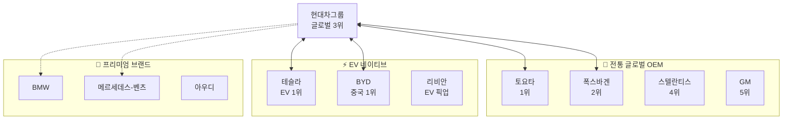
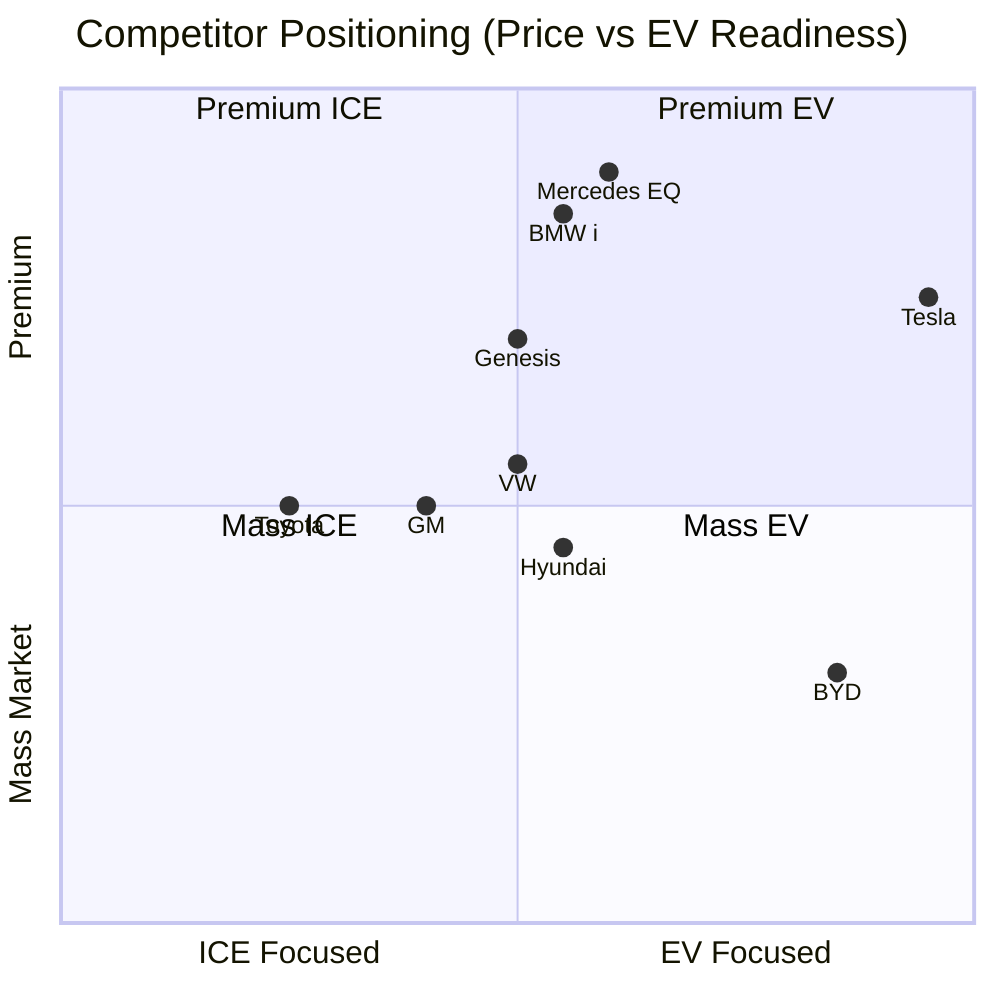
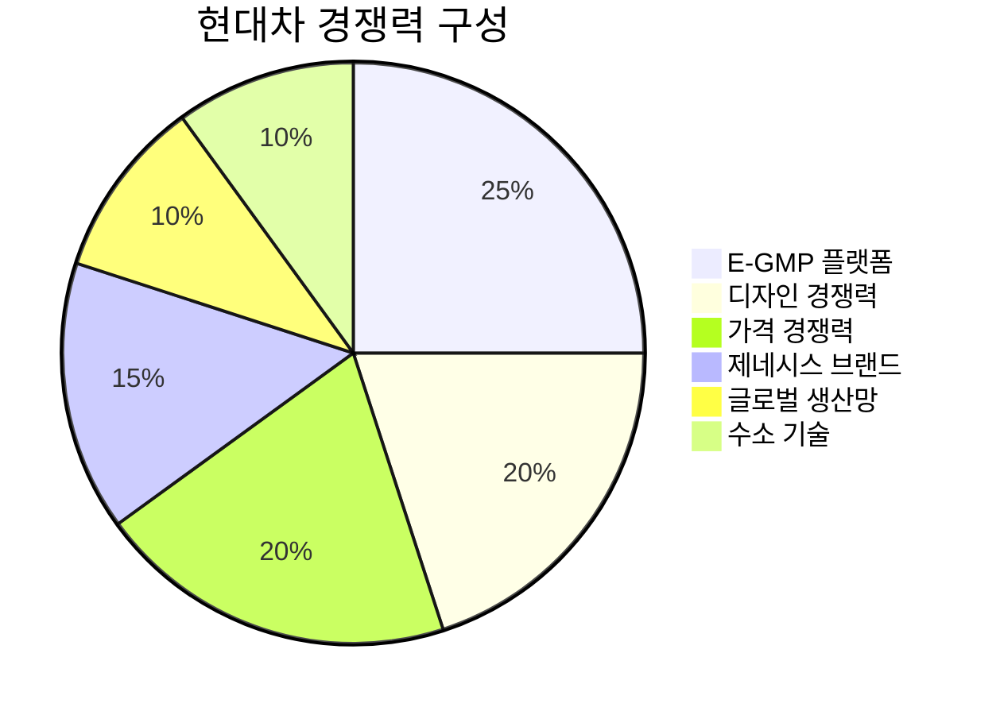

# 경쟁사 분석

## 경쟁 구도 개요

## 경쟁사 비교표

| 구분 | 현대차그룹 | 토요타 | 폭스바겐 | 테슬라 | BYD |
|------|-----------|--------|----------|--------|-----|
| **국가** | 🇰🇷 한국 | 🇯🇵 일본 | 🇩🇪 독일 | 🇺🇸 미국 | 🇨🇳 중국 |
| **2024 판매** | ~723만대[1] | ~1,101만대[1] | ~904만대[1] | ~179만대[1] | ~427만대[1] |
| **매출** | ~175조원[2] | ~45조엔[3] | ~325조유로[4] | ~95B USD[5] | ~617B CNY[6] |
| **시총** | ~150조원[AI 추정, 2024년 학습 데이터 기반] | ~350조원[AI 추정, 2024년 학습 데이터 기반] | ~90조원[AI 추정, 2024년 학습 데이터 기반] | ~$800B+[5] | ~130조원[AI 추정, 2024년 학습 데이터 기반] |
| **EV 비중** | ~12% | ~3% | ~10% | 100% | ~50% |
| **EV 플랫폼** | E-GMP | e-TNGA | MEB, SSP | 자체 | e-Platform |
| **배터리** | 외주 다변화 | 파나소닉+자체 | 외주 다변화 | 파나소닉+자체 | 자체 생산[6] |
| **자율주행** | Motional JV | Woven | Cariad | FSD | 자체 개발 |
| **강점** | 가성비, 디자인 | 품질, HEV | 브랜드, 규모 | SW, 브랜드 | 가격, 수직계열 |

## 상세 경쟁사 프로필

---

### 1. 토요타 (Toyota) 🎯 (1위 경쟁사)

> **"Mobility for All"**

| 항목 | 내용 |
|------|------|
| **본사** | 일본 아이치현 |
| **설립** | 1937년 |
| **2024 판매량** | ~1,101만대[1] (다이하츠 포함) |
| **시가총액** | ~350조원 |
| **브랜드** | Toyota, Lexus, Daihatsu |

**전략 포지셔닝:**
- 하이브리드 기술 선도 (프리우스 레거시)
- BEV 전환 상대적 보수적
- 전고체 배터리 집중 투자
- 수소 (미라이) 병행 추진

**vs 현대차 비교:**

| 항목 | 토요타 | 현대차 |
|------|--------|--------|
| 규모 | 1.5배 | 1x |
| BEV 전략 | 보수적 | 적극적 |
| HEV | 압도적 1위 | 성장 중 |
| 품질 | 최상위 | 상위권 진입 |
| 프리미엄 | Lexus (오래됨) | Genesis (성장 중) |

---

### 2. 폭스바겐 그룹 (Volkswagen Group) 🎯 (2위 경쟁사)

> **"Shaping mobility for generations to come"**

| 항목 | 내용 |
|------|------|
| **본사** | 독일 볼프스부르크 |
| **설립** | 1937년 |
| **2024 판매량** | ~904만대[1] |
| **시가총액** | ~90조원 |
| **브랜드** | VW, Audi, Porsche, Skoda, Lamborghini 등[4] |

**전략 포지셔닝:**
- MEB 플랫폼 기반 EV 전환 가속
- ID 시리즈 (ID.3, ID.4, ID.Buzz)
- Cariad 소프트웨어 자회사 (난항 중)
- 중국 시장 의존도 높음 (위기)

**vs 현대차 비교:**

| 항목 | 폭스바겐 | 현대차 |
|------|----------|--------|
| 브랜드 | 프리미엄 多 | Genesis 성장 |
| EV 전략 | MEB (범용) | E-GMP (효율) |
| 소프트웨어 | Cariad (난항) | 42dot (진행 중) |
| 중국 | 위기 | 이미 축소 |
| 수익성 | 하락 추세 | 개선 추세 |

---

### 3. 테슬라 (Tesla) ⚡ (EV 1위)

> **"Accelerating the world's transition to sustainable energy"**

| 항목 | 내용 |
|------|------|
| **본사** | 미국 텍사스 오스틴[5] |
| **설립** | 2003년[5] |
| **2024 판매량** | ~179만대[1] |
| **시가총액** | ~$800B+ (자동차 1위)[5] |
| **브랜드** | Tesla |

**전략 포지셔닝:**
- 소프트웨어 중심 자동차
- FSD (Full Self-Driving) 자율주행
- 슈퍼차저 네트워크
- 에너지 사업 병행 (Powerwall, Megapack)

**vs 현대차 비교:**

| 항목 | 테슬라 | 현대차 |
|------|--------|--------|
| EV 전용 | ✅ | ❌ (병행) |
| 소프트웨어 | 최강 | 성장 중 |
| 자율주행 | FSD (L2+) | HDA2 (L2) |
| 생산 규모 | 179만대 | 420만대 |
| 밸류에이션 | 극고평가 | 저평가 |
| 수익성 | 하락 중 | 개선 중 |

---

### 4. BYD ⚡ (중국 1위)

> **"Build Your Dreams"**

| 항목 | 내용 |
|------|------|
| **본사** | 중국 선전[6] |
| **설립** | 1995년 (2003년 자동차 진출)[6] |
| **2024 판매량** | ~427만대[1] (NEV) |
| **시가총액** | ~130조원 |
| **사업** | 자동차, 배터리, 전자[6] |

**전략 포지셔닝:**
- 배터리 수직계열화 (Blade Battery)[6]
- 극강의 가격 경쟁력
- PHEV + BEV 동시 공략
- 글로벌 확장 가속 (유럽, 동남아, 남미)

**vs 현대차 비교:**

| 항목 | BYD | 현대차 |
|------|-----|--------|
| 배터리 | 자체 생산 | 외주 |
| 가격 | 최저가 | 중가 |
| 글로벌 | 확장 중 | 확립 |
| 브랜드 | 성장 중 | 확립 |
| 기술 | 가성비 중심 | 밸런스 |
| 프리미엄 | 양왕, 덴자 | Genesis |

---

### 5. 제네시스 vs 독일 프리미엄 💎

**프리미엄 세그먼트 경쟁:**

| 항목 | Genesis | BMW | Mercedes | Audi |
|------|---------|-----|----------|------|
| 설립 | 2015 | 1916 | 1926 | 1909 |
| 판매량 | ~25만대[AI 추정, 2024년 학습 데이터 기반] | ~245만대[7] | ~239만대[7] | ~190만대[AI 추정, 2024년 학습 데이터 기반] |
| 핵심 시장 | 한국, 북미 | 글로벌 | 글로벌 | 글로벌 |
| EV | GV60, eG80 | i시리즈 | EQ시리즈 | e-tron |
| 강점 | 가성비, 디자인 | 주행성능 | 럭셔리 | 기술 |

---

## 포지셔닝 맵

## 경쟁 우위 분석

### 현대차의 경쟁 우위 요소

### 경쟁 대응 전략

| 경쟁사 | 위협 수준 | 대응 전략 |
|--------|----------|----------|
| **토요타** | 🟡 중간 | HEV 경쟁력 강화, BEV 선점 유지 |
| **폭스바겐** | 🟡 중간 | 수익성 우위 유지, 유럽 시장 공략 |
| **테슬라** | 🔴 높음 | SW 역량 강화, 브랜드 차별화 |
| **BYD** | 🔴 높음 | 가격 경쟁 회피, 프리미엄화, 선진시장 집중 |
| **독일 프리미엄** | 🟡 중간 | Genesis 확대, 북미/유럽 딜러망 강화 |

---

## 벤치마킹 인사이트

### 테슬라에서 배울 점

1. **소프트웨어 중심**: OTA, FSD, 차량 OS
2. **직판 모델**: 딜러 없는 직접 판매/서비스
3. **충전 네트워크**: 슈퍼차저 락인 효과
4. **브랜드 파워**: 기술 선도 이미지

### BYD에서 배울 점

1. **수직계열화**: 배터리 내재화로 원가 경쟁력
2. **속도**: 신차 개발/출시 사이클 단축
3. **로컬 최적화**: 시장별 맞춤 전략

### 토요타에서 배울 점

1. **품질 관리**: TPS (Toyota Production System)
2. **하이브리드 기술**: 30년 축적
3. **보수적 재무**: 현금 보유 + 투자 여력

---

> 📌 **결론**: 현대차는 전통 OEM 중 EV 전환에 가장 적극적. 테슬라/BYD의 가격/SW 경쟁에 대응하면서, Genesis로 프리미엄 시장 공략이 핵심 전략. 토요타 대비 BEV 선점, 폭스바겐 대비 수익성 우위 확보 중.

## 출처

[1] Wikipedia - List of manufacturers by motor vehicle production (2024), 토요타 11,011,375대, 폭스바겐 9,037,425대, 현대차그룹 7,231,248대, BYD 4,272,145대, 테슬라 1,789,226대, https://en.wikipedia.org/wiki/List_of_manufacturers_by_motor_vehicle_production

[2] Wikipedia - Hyundai Motor Company, Revenue ₩175.23 trillion (2024), https://en.wikipedia.org/wiki/Hyundai_Motor_Company

[3] Wikipedia - Toyota, Revenue ¥45.1 trillion (2024), https://en.wikipedia.org/wiki/Toyota

[4] Wikipedia - Volkswagen Group, Revenue €324.656 billion (2024), 브랜드: Audi, Bentley, Porsche, SEAT, Škoda, Volkswagen 등, https://en.wikipedia.org/wiki/Volkswagen_Group

[5] Wikipedia - Tesla, Inc., 본사 Austin Texas, 설립 2003년, Revenue US$94.83 billion (2025), https://en.wikipedia.org/wiki/Tesla,_Inc.

[6] Wikipedia - BYD Auto, 본사 선전, 설립 2003년, 배터리 자체생산 (FinDreams Battery), Revenue ¥617.1 billion (2024), https://en.wikipedia.org/wiki/BYD_Auto

[7] Wikipedia - List of manufacturers by motor vehicle production (2024), BMW 2,450,854대, Mercedes 2,389,365대, https://en.wikipedia.org/wiki/List_of_manufacturers_by_motor_vehicle_production

**참고**: 시가총액 데이터는 실시간 변동하는 값으로, 정확한 검증을 위해서는 Bloomberg, Yahoo Finance, 각 사 IR 페이지 등 금융 데이터 제공업체의 최신 데이터 확인이 필요합니다. Genesis와 Audi 개별 판매량은 모회사 통합 보고로 인해 개별 검증이 어려울 수 있습니다.
