# 시장 분석: 글로벌 자동차 산업

## 시장 개요

### 타겟 시장 정의

현대자동차가 속한 시장:
- **1차 시장**: 글로벌 완성차 시장
- **2차 시장**: 전기차 (BEV/PHEV) 시장
- **3차 시장**: 프리미엄 자동차 시장
- **4차 시장**: 모빌리티 서비스 시장

### 시장 규모 (글로벌)

| 시장 | 2024 규모 | 2030 전망 | CAGR |
|------|----------|----------|------|
| 글로벌 자동차 | $3.1T[AI 추정, 2024년 학습 데이터 기반] | $3.9T | 3.8% |
| 전기차 (BEV) | $890.7B[7] | $2.5T | 11%[7] |
| 수소차 (FCEV) | $6B | $40B | 37.2% |
| 자율주행 | $54B | $556B | 39.3% |
| 모빌리티 서비스 | $350B | $750B | 13.5% |

> *참고: McKinsey, BloombergNEF, IEA (2024) 보고서 기반 추정치*

### 글로벌 자동차 판매량

| 연도 | 판매량 | YoY | 비고 |
|------|--------|-----|------|
| 2019 | 9,040만대 | -4% | 코로나 직전 |
| 2020 | 7,800만대 | -14% | 코로나 충격 |
| 2021 | 8,270만대 | +6% | 반도체 부족 |
| 2022 | 8,100만대 | -2% | 공급망 이슈 |
| 2023 | 8,600만대 | +6% | 회복세 |
| 2024 | 9,300만대[1] | +8% | 정상화 |

### 지역별 시장

| 지역 | 2024 판매량 | 점유율 | 성장률 |
|------|------------|--------|--------|
| 중국 | 2,750만대[2] | 30% | +3% |
| 미국 | 1,580만대 | 17% | +2% |
| 유럽 | 1,400만대 | 15% | +4% |
| 인도 | 520만대 | 6% | +8% |
| 한국 | 180만대 | 2% | +1% |
| 기타 | 2,670만대 | 29% | +5% |

## 시장 동향

### 메가트렌드: CASE

```mermaid
mindmap
  root((CASE 트렌드))
    Connected
      V2X 통신
      OTA 업데이트
      인포테인먼트
      구독 서비스
    Autonomous
      L2+ ADAS 보급
      L4 로보택시 시범
      규제 정비 중
      센서 원가 하락
    Shared
      카셰어링
      라이드헤일링
      MaaS 플랫폼
      B2B 플릿
    Electric
      BEV 침투율 상승
      배터리 가격 하락
      충전 인프라 확대
      정부 보조금
```

### 전기차 시장 동향

**글로벌 BEV 판매량:**

| 연도 | 판매량 | 침투율 |
|------|--------|--------|
| 2020 | 310만대 | 4.0%[3] |
| 2021 | 670만대 | 8.1%[3] |
| 2022 | 1,050만대 | 13.0%[3] |
| 2023 | 1,380만대[4] | 18.0%[4] |
| 2024E | 1,600만대 | 22.0%[4] |
| 2030E | 4,000만대 | 40%+ |

**지역별 BEV 침투율 (2024):**

| 지역 | 침투율 | 주요 요인 |
|------|--------|----------|
| 노르웨이 | 93%+[5] | 강력한 인센티브 |
| 중국 | 37%[5] | 정부 정책, 로컬 브랜드 |
| 유럽 | 24%[5] | 규제 (2035 ICE 금지) |
| 한국 | ~10%[5] | 보조금, 인프라 |
| 미국 | ~10%[5] | IRA, 인센티브 |
| 인도 | 2%[5] | 가격 민감, 인프라 부족 |

### 배터리 시장

| 항목 | 2024 | 2030E | 비고 |
|------|------|-------|------|
| 배터리 가격 | $115-139/kWh[8] | $70/kWh | 30~40% 하락 전망 |
| 배터리 수요 | 800GWh | 3,500GWh | 4배 이상 성장 |
| 주요 공급자 | CATL, LG, 파나소닉 | | |

## 시장 성장 드라이버

### 1. 전기차 전환 가속

```mermaid
timeline
    title EV 전환 타임라인
    2020 : BEV 침투 4%
         : 테슬라 모델3 히트
    2023 : BEV 침투 16%
         : 중국 BYD 부상
    2025 : BEV 침투 25% 전망
         : 배터리 가격 $100/kWh 근접
    2030 : BEV 침투 40%+ 전망
         : 주요국 ICE 규제 시작
    2035 : 유럽 ICE 판매 금지
         : BEV 주류화
```

### 2. 규제 강화

| 지역 | 규제 내용 | 시행 시기 |
|------|----------|----------|
| EU | ICE 신차 판매 금지[6] | 2035 |
| 캘리포니아 | ICE 신차 판매 금지 | 2035 |
| 영국 | ICE 신차 판매 금지 | 2035 |
| 중국 | NEV 판매 비중 의무화 | 진행 중 |
| 한국 | 2030 전기차 33% 목표 | 2030 |

### 3. 소비자 수용도 증가

- 주행거리 불안 해소 (500km+ 일반화)
- 충전 인프라 확대
- TCO(총소유비용) 경쟁력 확보
- EV 전용 디자인/성능 매력

### 4. 기술 혁신

- 전고체 배터리 (2027~2030 상용화 전망)
- 800V 고전압 시스템 보급
- SiC 인버터 효율 개선
- SDV (Software Defined Vehicle) 전환

## 고객 세그먼트

### 지역별 특성

| 지역 | 선호 세그먼트 | 핵심 요인 | 현대차 전략 |
|------|-------------|----------|------------|
| 북미 | SUV, 픽업 | 크기, 파워 | 팰리세이드, 싼타페 강화 |
| 유럽 | 소형, 해치백, EV | 연비, 환경 | i20, 코나, IONIQ 라인업 |
| 중국 | 로컬 선호, NEV | 가격, 기술 | 로컬 파트너십, EV 강화 |
| 인도 | 소형, 가성비 | 가격 | 크레타, 베뉴 강화 |
| 한국 | 국산 충성, SUV | 브랜드, 디자인 | 풀라인업 유지 |

### 세그먼트별 트렌드

| 세그먼트 | 트렌드 | 현대차 대응 |
|----------|--------|------------|
| SUV | 지속 성장, 쿠페형 | 투싼, 싼타페, 팰리세이드, GV70/80 |
| 세단 | 정체/감소 | 선택적 유지 (쏘나타, G80) |
| 전기차 | 급성장 | IONIQ 라인업 확대 |
| 프리미엄 | 안정 성장 | 제네시스 브랜드 강화 |
| 픽업 | 북미 핵심 | 싼타크루즈, 향후 EV 픽업 검토 |

## 진입 장벽

### 높은 장벽

- 🔴 **자본 집약**: 공장, R&D 투자 수조원 단위
- 🔴 **기술 장벽**: 플랫폼, 파워트레인 개발 10년+
- 🔴 **브랜드 구축**: 글로벌 인지도 확보 수십 년
- 🔴 **딜러 네트워크**: 판매/서비스 인프라 구축
- 🔴 **규제 인증**: 안전/환경 인증 복잡

### 변화하는 장벽

- 🟡 **EV 전환**: 신규 진입자 기회 (테슬라, 리비안, BYD)
- 🟡 **소프트웨어**: 전통 OEM 약점, 테크 기업 강점
- 🟡 **배터리**: 수직계열화 vs 외주 전략 분화

## SWOT 분석: 현대자동차

### 상세 SWOT

| | 긍정적 | 부정적 |
|---|---|---|
| **내부** | **강점 (S)** | **약점 (W)** |
| | • E-GMP 플랫폼 경쟁력 | • 중국 시장 점유율 하락 |
| | • 제네시스 프리미엄 안착 | • 소프트웨어 역량 부족 |
| | • 수소차 기술 선도 | • 노사관계 리스크 |
| | • 글로벌 생산 네트워크 | • 브랜드 프리미엄 한계 |
| | • 비용 경쟁력 | • 자율주행 기술 격차 |
| **외부** | **기회 (O)** | **위협 (T)** |
| | • EV 시장 급성장 | • 테슬라/BYD 경쟁 심화 |
| | • 인도 시장 확대 | • 원자재 가격 변동 |
| | • 미국 IRA 수혜 | • 중국 OEM 글로벌 진출 |
| | • 수소 경제 활성화 | • 환율 변동 리스크 |
| | • SDV 전환 기회 | • 경기 침체 우려 |

---

> 📌 **시사점**: 현대차는 EV 전환기에 적절히 대응 중. E-GMP 경쟁력과 제네시스 성공을 기반으로 프리미엄화 + 전동화 동시 추진. 다만 중국 부진, 소프트웨어 역량 강화가 과제.

## 출처

[1] Statista - Worldwide automobile production (2024), "In 2024, some 93 million motor vehicles were produced worldwide", https://www.statista.com/statistics/262747/worldwide-automobile-production-since-2000/

[2] Statista - China automobile production (2024), "China is ranked as the largest passenger car manufacturer in the world, having produced almost 27.5 million cars in 2024", https://www.statista.com/statistics/262747/worldwide-automobile-production-since-2000/

[3] Wikipedia - Electric car use by country, Global PEV market share history 2020-2022, https://en.wikipedia.org/wiki/Electric_car_use_by_country

[4] IEA - Global EV Outlook 2024, Global EV sales and market share data, https://www.iea.org/reports/global-ev-outlook-2024

[5] Wikipedia - Electric car use by country (2023-2024), Norway 93%, China 37%, Europe 24%, US ~10%, https://en.wikipedia.org/wiki/Electric_car_use_by_country

[6] Wikipedia - Phase-out of fossil fuel vehicles, EU ICE ban 2035, https://en.wikipedia.org/wiki/Phase-out_of_fossil_fuel_vehicles

[7] Precedence Research - Electric Vehicle Market Size, 2024년 글로벌 전기차 시장 규모 USD 890.72 billion, 2034년 USD 2,529.10 billion 전망, CAGR 11%, https://www.precedenceresearch.com/electric-vehicle-market

[8] Wikipedia - Electric vehicle battery, Li-NMC 배터리 가격 $130-139/kWh (2024), LFP 배터리 $70-105/kWh, https://en.wikipedia.org/wiki/Electric_vehicle_battery
